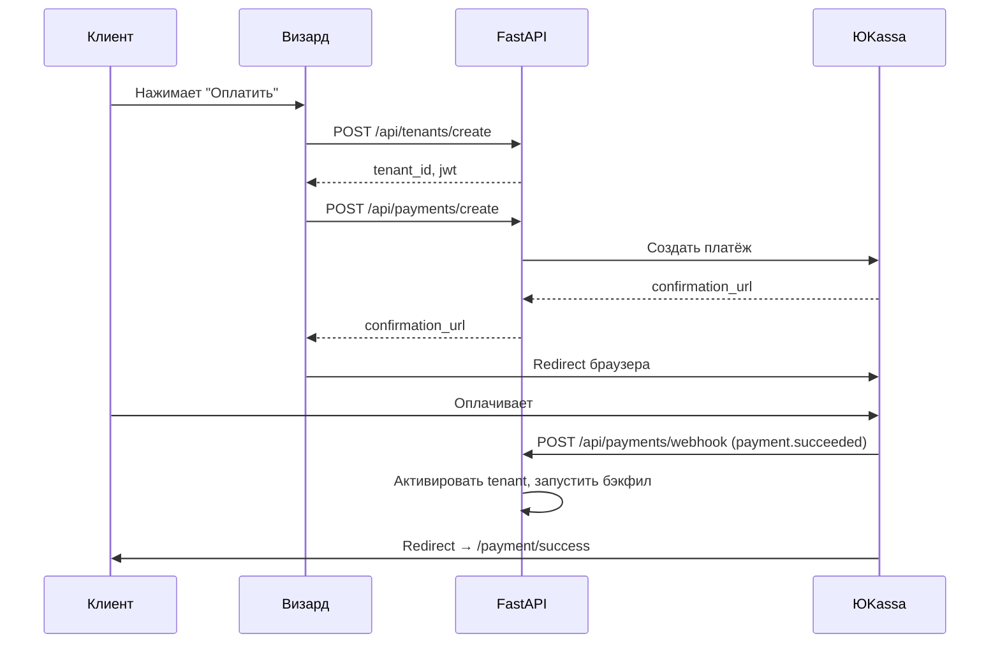

# Web Spec — Страницы оплаты (результат)

> Статус: 🟡 На согласовании
> Автор: @веб
> Дата: 26 февраля 2026

---

## Страница

**Название:** Результат оплаты (success / fail) + страница счёта для юрлица

**URL:**
- `/payment/success?payment_id=...` — после успешной оплаты через ЮKassa
- `/payment/fail?payment_id=...` — после неуспешной оплаты
- `/payment/invoice?invoice_id=...` — страница со счётом для юрлица

**Тип:**
- [x] Форма / информационная
- [x] Полу-публичная (доступна по прямой ссылке, но привязана к конкретному платежу)

---

## Авторизация

**Нужна:** нет (страницы доступны по уникальным ID в URL)

---

## Компоненты страниц

### 1. Payment Success (`/payment/success`)

```
┌──────────────────────────────────────────┐
│                                          │
│              ✅                           │
│                                          │
│    Оплата прошла успешно!                │
│                                          │
│    Компания: Ёбидоёби                    │
│    Тариф: Базовый + Финансы              │
│    Оплачено: 24 000 ₽                    │
│    Следующее списание: 26 марта 2026     │
│                                          │
│    ─────────────────────────────────     │
│                                          │
│    Что дальше:                           │
│    1. Бот уже настраивает вашу систему   │
│    2. В течение часа данные за месяц     │
│       будут загружены                    │
│    3. Алерты и отчёты начнут приходить   │
│       завтра утром                       │
│                                          │
│    [Перейти в личный кабинет]            │
│                                          │
└──────────────────────────────────────────┘
```

**Поведение:**
- При загрузке: `GET /api/payments/{payment_id}/status` → показать детали
- JWT-токен уже в cookie (из визарда) → кнопка ведёт в кабинет
- Если нет JWT — показать кнопку «Войти»

---

### 2. Payment Fail (`/payment/fail`)

```
┌──────────────────────────────────────────┐
│                                          │
│              ❌                           │
│                                          │
│    Оплата не прошла                      │
│                                          │
│    Возможные причины:                    │
│    • Недостаточно средств на карте       │
│    • Карта заблокирована банком          │
│    • Технический сбой                    │
│                                          │
│    [Попробовать снова]                   │
│    [Выбрать другой способ оплаты]        │
│                                          │
│    Или напишите нам:                     │
│    Telegram: @artemiy_shelomentsev       │
│                                          │
└──────────────────────────────────────────┘
```

**Поведение:**
- «Попробовать снова» → `POST /api/payments/create` → новый redirect на ЮKassa
- «Выбрать другой способ оплаты» → возврат на Шаг 6 визарда

---

### 3. Invoice Page (`/payment/invoice`)

```
┌──────────────────────────────────────────┐
│                                          │
│    📄 Счёт на оплату                     │
│                                          │
│    Счёт №: АРК-2026-001                  │
│    Дата: 26.02.2026                      │
│    Статус: ожидает оплаты                │
│                                          │
│    Плательщик: ООО "Ёбидоёби"            │
│    ИНН: 1234567890                       │
│                                          │
│    ─────────────────────────────────     │
│    Базовый пакет (2 точки)   10 000 ₽   │
│    Финансы (2 точки)          4 000 ₽   │
│    Подключение               10 000 ₽   │
│    ─────────────────────────────────     │
│    Итого:                    24 000 ₽   │
│                                          │
│    [Скачать PDF]                         │
│    [Скачать акт]                         │
│                                          │
│    Реквизиты для оплаты:                 │
│    ИП Шеломенцев А.А.                    │
│    ИНН: ...                              │
│    Расчётный счёт: ...                   │
│    Банк: ...                             │
│    БИК: ...                              │
│                                          │
│    После оплаты подтвердите:             │
│    [Я оплатил — активировать]            │
│                                          │
└──────────────────────────────────────────┘
```

**Поведение:**
- При загрузке: `GET /api/invoices/{invoice_id}` → показать детали
- «Скачать PDF» → `GET /api/invoices/{invoice_id}/download?format=pdf`
- «Скачать акт» → `GET /api/invoices/{invoice_id}/download?format=act`
- «Я оплатил» → `POST /api/invoices/{invoice_id}/confirm` → ручная активация (Артемий подтвердит)
- Статус обновляется: `ожидает оплаты` → `оплачен` → `активирован`

---

## ЮKassa — Flow



---

## Данные (что нужно от @интегратора)

### API endpoints

**1. Статус платежа**
```
GET /api/payments/{payment_id}/status

Response (200):
{
  "payment_id": "uuid-...",
  "status": "succeeded",
  "amount": 24000,
  "tenant_name": "Ёбидоёби",
  "modules": ["base", "finance"],
  "branches_count": 2,
  "next_payment_date": "2026-03-26",
  "created_at": "2026-02-26T14:30:00"
}
```

**2. Webhook от ЮKassa**
```
POST /api/payments/webhook
Body: (ЮKassa notification format)

Действия при payment.succeeded:
- Активировать tenant (status: active)
- Запустить бэкфил заказов за месяц
- Отправить confirmation email
- Отправить уведомление Артемию в Telegram
```

**3. Детали счёта**
```
GET /api/invoices/{invoice_id}

Response (200):
{
  "invoice_id": "uuid-...",
  "invoice_number": "АРК-2026-001",
  "status": "pending",
  "amount": 24000,
  "tenant_name": "ООО Ёбидоёби",
  "inn": "1234567890",
  "items": [
    { "name": "Базовый пакет (2 точки)", "amount": 10000 },
    { "name": "Финансы (2 точки)", "amount": 4000 },
    { "name": "Подключение", "amount": 10000 }
  ],
  "created_at": "2026-02-26"
}
```

**4. Скачивание документов**
```
GET /api/invoices/{invoice_id}/download?format=pdf
GET /api/invoices/{invoice_id}/download?format=act

Response: application/pdf
```

**5. Подтверждение оплаты (юрлицо)**
```
POST /api/invoices/{invoice_id}/confirm

Response (200):
{
  "status": "pending_verification",
  "message": "Заявка на подтверждение отправлена. Активируем в течение 1 рабочего дня"
}
```

---

## Пустые состояния

- **Платёж не найден (невалидный ID):** «Платёж не найден» + ссылка на главную
- **Платёж в обработке:** спиннер + «Обработка платежа, подождите...» + авто-обновление каждые 5 сек
- **Счёт уже оплачен:** зелёный статус + «Счёт уже оплачен. Перейдите в кабинет»

---

## Стек и ограничения

**Фронтенд:** HTML + Tailwind CSS + минимальный JS

**Обоснование:** результатные страницы (success/fail/invoice) — статические с минимальной логикой. Один GET-запрос при загрузке, скачивание PDF. Vanilla JS.

**Адаптивность:** mobile-first
**Браузеры:** Chrome, Safari (последние 2 версии)

---

## Тип страницы по аудитории

- [x] **Публичная / продажная** — завершение покупки
- [ ] Приватная / операционная

## Мультиклиентность

- [x] Страница показывает данные одного клиента (по payment_id / invoice_id)
- [ ] Страница общая для всех

---

## Зависимости от @интегратора

- [ ] `GET /api/payments/{id}/status` — детали платежа для success-страницы
- [ ] `POST /api/payments/webhook` — webhook от ЮKassa
- [ ] `GET /api/invoices/{id}` — детали счёта
- [ ] `GET /api/invoices/{id}/download` — скачивание PDF счёта/акта
- [ ] `POST /api/invoices/{id}/confirm` — подтверждение оплаты юрлицом
- [ ] Интеграция с ЮKassa (API ключи, webhook URL)
- [ ] Генерация PDF-счёта и акта

---

## Заметки для @интегратора

- ЮKassa: рекуррентные платежи (save_payment_method: true) для автоматического продления
- Webhook URL: `https://arkentiy.ru/api/payments/webhook` — добавить в настройки ЮKassa
- При `payment.succeeded` — сразу активировать тенант, не ждать ручного подтверждения
- При `payment.canceled` — не деактивировать тенант (у него grace period 7 дней)
- Счёт для юрлица — ручной процесс на MVP: клиент нажимает «Я оплатил», Артемий проверяет и подтверждает
- Генерация PDF — можно через библиотеку `reportlab` или `weasyprint`
- Нумерация счетов: АРК-YYYY-NNN (автоинкремент)
